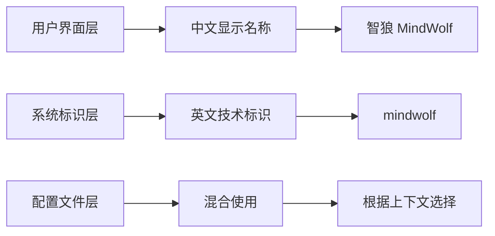
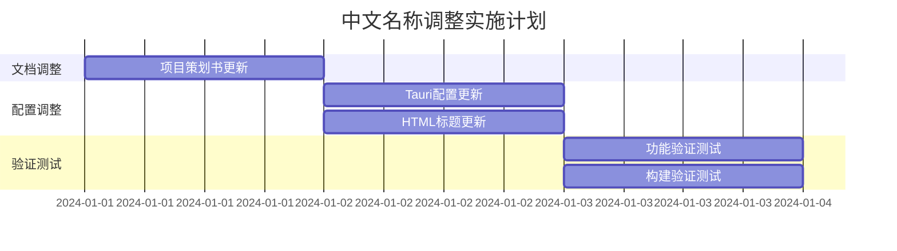

# 智狼项目中文名称统一调整设计

## 概述

本设计文档描述了将"MindWolf"项目的中文名称统一调整为"智狼"，英文名称保持"MindWolf"的完整方案。项目中存在不一致的命名，需要进行全面的梳理和调整。

## 项目类型检测

基于代码库分析，这是一个**桌面应用项目**，使用Tauri 2.x + Vue3 + Rust技术栈构建的AI狼人杀游戏。

## 现状分析

### 当前命名情况

通过代码库扫描，发现以下命名状态：

| 位置 | 当前名称 | 状态 |
|------|----------|------|
| 项目策划书 | 心智迷宫 (Mind Maze) | ❌ 需要调整 |
| tauri.conf.json (productName) | mindwolf | ❌ 需要调整 |
| tauri.conf.json (window title) | mindwolf | ❌ 需要调整 |
| index.html (title) | Tauri + Vue + Typescript App | ❌ 需要调整 |
| 前端界面 (Home.vue) | 智狼 (MindWolf) | ✅ 已正确 |
| README.md | 智狼 (MindWolf) | ✅ 已正确 |
| Rust代码注释 | 智狼 (MindWolf) | ✅ 已正确 |

### 问题识别

1. **项目策划书命名不一致**: 使用了"心智迷宫 (Mind Maze)"而非"智狼 (MindWolf)"
2. **应用配置未汉化**: tauri.conf.json中产品名称和窗口标题未使用中文
3. **HTML标题未更新**: index.html仍使用默认的框架标题

## 调整方案

### 命名标准

```mermaid
graph TD
    A[统一命名标准] --> B[中文名称: 智狼]
    A --> C[英文名称: MindWolf]
    A --> D[显示格式: 智狼 (MindWolf)]
    A --> E[应用标识: mindwolf]
```

### 文件调整清单

| 文件路径 | 调整内容 | 优先级 |
|----------|----------|--------|
| `项目策划书.md` | 将"心智迷宫 (Mind Maze)"改为"智狼 (MindWolf)" | 高 |
| `mindwolf/src-tauri/tauri.conf.json` | 更新productName和window title | 高 |
| `mindwolf/index.html` | 更新页面标题为"智狼 (MindWolf)" | 中 |

### 具体调整内容

#### 1. 项目策划书调整

**调整位置**: `项目策划书.md` 第6行

**原内容**:
```
### **项目策划书：AI狼人杀《心智迷宫 (Mind Maze)》**
```

**调整为**:
```
### **项目策划书：AI狼人杀《智狼 (MindWolf)》**
```

#### 2. Tauri应用配置调整

**调整位置**: `mindwolf/src-tauri/tauri.conf.json`

**原内容**:
```json
{
  "productName": "mindwolf",
  "app": {
    "windows": [
      {
        "title": "mindwolf"
      }
    ]
  }
}
```

**调整为**:
```json
{
  "productName": "智狼",
  "app": {
    "windows": [
      {
        "title": "智狼 (MindWolf) - AI狼人杀游戏"
      }
    ]
  }
}
```

#### 3. HTML页面标题调整

**调整位置**: `mindwolf/index.html`

**原内容**:
```html
<title>Tauri + Vue + Typescript App</title>
```

**调整为**:
```html
<title>智狼 (MindWolf) - AI狼人杀游戏</title>
```

## 技术考虑

### 兼容性影响

1. **应用标识保持不变**: package.json、Cargo.toml中的name字段保持"mindwolf"以确保构建兼容性
2. **API接口不受影响**: 内部标识符和API名称保持不变
3. **数据库兼容性**: 现有数据库和配置文件不受影响

### 构建影响

- Tauri配置变更后需要重新构建应用
- 生成的安装包名称可能会改变为中文名称
- 应用在系统中的显示名称将更新为"智狼"

### 本地化策略



## 验证方案

### 调整后验证清单

- [ ] 项目策划书中所有"心智迷宫"已替换为"智狼"
- [ ] 应用窗口标题正确显示"智狼 (MindWolf)"
- [ ] 系统任务栏显示正确的应用名称
- [ ] 浏览器标签页标题正确显示
- [ ] 应用关于页面信息一致
- [ ] 构建生成的安装包名称合适

### 测试场景

1. **启动应用验证**: 检查窗口标题和任务栏显示
2. **页面标题验证**: 确认浏览器标签页标题
3. **关于页面验证**: 检查应用内部关于信息的一致性
4. **构建验证**: 确认构建产物的命名正确性

## 风险评估

### 潜在风险

| 风险项 | 影响程度 | 缓解措施 |
|--------|----------|----------|
| 构建失败 | 中 | 保持技术标识符不变 |
| 用户混淆 | 低 | 保持英文名称作为副标题 |
| 文档不一致 | 低 | 统一所有文档中的命名 |

### 回滚方案

如果调整后出现问题，可以通过以下步骤快速回滚：
1. 恢复tauri.conf.json中的原始配置
2. 重新构建应用
3. 恢复文档中的原始命名

## 实施时序



## 成功标准

调整完成后，项目应达到以下标准：

1. **命名一致性**: 所有用户可见的地方统一显示"智狼 (MindWolf)"
2. **技术稳定性**: 应用功能不受命名调整影响
3. **用户体验**: 用户界面中的命名清晰、一致、易理解
4. **文档完整性**: 所有项目文档中的命名保持一致

通过本次调整，将实现项目中文名称的完全统一，提升品牌一致性和用户体验。