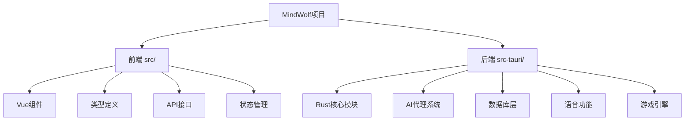
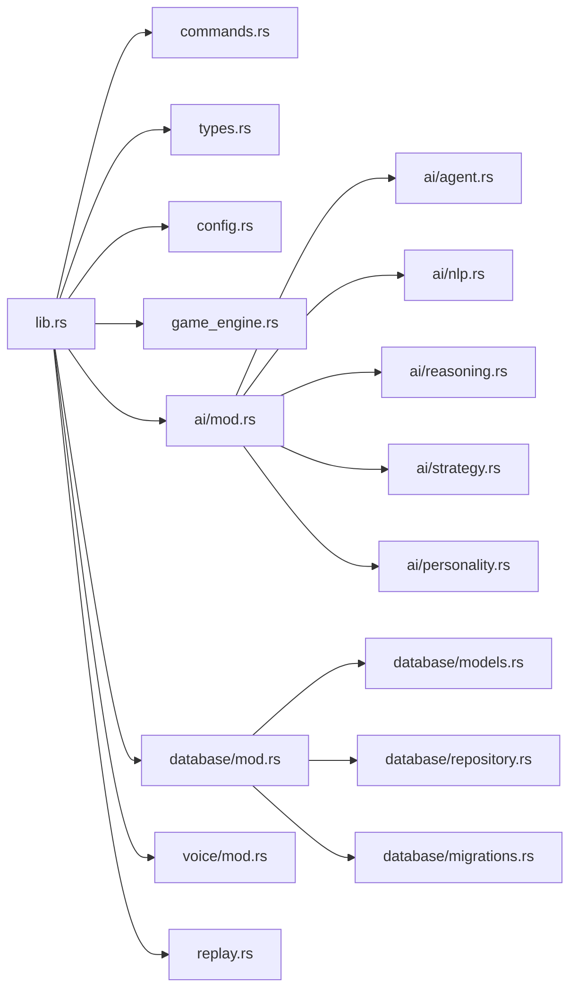
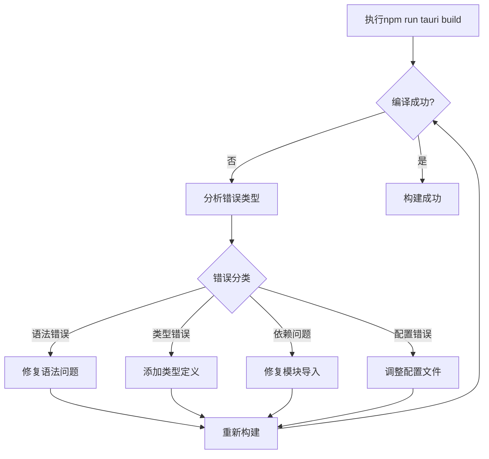
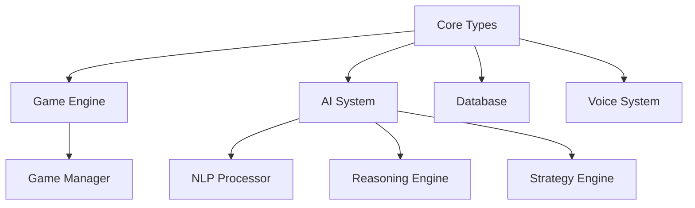

# MindWolf项目构建与错误修复设计文档

## 概述

本文档记录了MindWolf项目的构建问题诊断与修复流程，项目是基于Tauri 2.x + Vue 3 + TypeScript + Rust的跨平台桌面应用。

## 技术栈概况

- **前端**: Vue 3 + TypeScript + Element Plus + Pinia + Vite
- **后端**: Rust + Tauri 2.x + SQLite
- **构建工具**: npm/pnpm + cargo
- **AI集成**: OpenAI兼容API + 自然语言处理模块

## 项目结构分析



### 核心模块依赖关系



## 构建错误诊断流程

### 第一阶段：环境检查与依赖验证

1. **检查Node.js和Rust环境**
2. **验证package.json和Cargo.toml配置**
3. **检查前端依赖完整性**
4. **验证Rust依赖兼容性**

### 第二阶段：编译错误分析

通过运行构建命令识别具体错误类型：
- 语法错误
- 类型不匹配
- 模块导入问题
- 依赖缺失
- 配置错误

### 第三阶段：系统性错误修复

基于错误类型制定修复策略：



## 常见错误类别与修复策略

### 1. Rust编译错误

#### 类型不匹配
- **问题**: Rust严格的类型系统要求精确的类型匹配
- **解决方案**: 添加适当的类型注解和转换

#### Trait实现缺失
- **问题**: 结构体缺少必需的trait实现
- **解决方案**: 为相关结构体添加Debug、Clone等trait

#### 模块导入问题
- **问题**: 模块路径不正确或循环依赖
- **解决方案**: 重构模块结构，明确导入路径

### 2. 前端构建错误

#### TypeScript类型错误
- **问题**: 类型定义不完整或不匹配
- **解决方案**: 完善类型定义文件

#### 依赖版本冲突
- **问题**: 包版本不兼容
- **解决方案**: 更新或降级相关依赖

### 3. Tauri集成错误

#### 命令绑定问题
- **问题**: Rust命令与前端调用不匹配
- **解决方案**: 确保命令签名一致性

#### 配置文件错误
- **问题**: tauri.conf.json配置不正确
- **解决方案**: 验证并修复配置项

## 具体错误发现与修复方案

### 错误1: BOM字符问题

**文件**: `src-tauri/src/voice/mod.rs`
**问题**: 文件开头存在BOM字符(`\uFEFF`)
**错误表现**: Rust编译器无法识别模块声明
**修复方案**:
```bash
# 方法1：使用编辑器去除BOM
# 将文件重新保存为UTF-8 without BOM

# 方法2：命令行方式
sed -i '1s/^\xEF\xBB\xBF//' src-tauri/src/voice/mod.rs
```
**修复代码**:
```rust
// 修复前：
pub mod asr;
// 修复后：
pub mod asr;
```

### 错误2: 类型定义冲突

**问题**: 多个模块中存在相同类型名称定义
**影响文件**:
- `src-tauri/src/types.rs`
- `src-tauri/src/ai/agent.rs`
- `src-tauri/src/database/models.rs`

**冲突类型**:
1. `VoteRecord` - 在types.rs和database/models.rs中重复定义
2. `SpeechRecord` - 在types.rs和database/models.rs中重复定义
3. `NightActionRecord` - 在ai/strategy.rs和database/models.rs中重复定义

**修复方案**:
1. 统一类型定义到types.rs
2. 其他模块使用use导入
3. 为数据库模型添加不同的命名空间

### 错误3: 缺失的Trait实现

**问题**: 部分结构体缺少必要的trait实现
**需要添加的Trait**:

```rust
// 为以下结构体添加Debug trait
#[derive(Debug)]
pub struct StrategyEngine { ... }

// 为数据库模型添加必要的traits
#[derive(Debug, Clone, Serialize, Deserialize, sqlx::FromRow)]
pub struct GameRecord { ... }
```

### 错误4: 模块导入问题

**问题**: 某些模块文件中存在循环依赖或未正确导入
**修复方案**:

1. **reasoning.rs缺少方法实现**:
```rust
impl ReasoningEngine {
    // 添加缺失的方法
    pub fn get_most_trusted_player(&self) -> Option<String> {
        // 实现逻辑
    }
    
    pub fn get_analysis_report(&self) -> ReasoningReport {
        // 实现逻辑
    }
}
```

2. **strategy.rs缺少方法实现**:
```rust
impl StrategyEngine {
    // 添加缺失的方法
    pub fn update_strategy(&mut self, game_state: &GameState, reasoning: &ReasoningEngine) {
        // 实现逻辑
    }
    
    pub fn generate_speech_strategy(&self, game_state: &GameState, reasoning: &ReasoningEngine, speech_type: SpeechType) -> SpeechStrategy {
        // 实现逻辑
    }
}
```

3. **nlp.rs缺少类型定义**:
```rust
#[derive(Debug, Clone)]
pub struct SpeechAnalysis {
    pub credibility: f32,
    pub suspicion_weight: f32,
    pub confidence: f32,
    pub summary: String,
}
```

### 错误5: 数据库Feature配置

**问题**: error.rs中使用了sqlx条件编译但Cargo.toml中未启用相应feature
**修复方案**:
```rust
// 修改error.rs中的条件编译
#[cfg(feature = "sqlx")] // 改为
impl From<sqlx::Error> for AppError {
    fn from(err: sqlx::Error) -> Self {
        AppError::Database(err.to_string())
    }
}
```

### 错误6: 类型定义不一致

**问题**: 同名类型在不同模块中有不同的定义
**具体冲突**:

1. **SpeechRecord类型冲突**:
   - `types.rs` 中定义的 `SpeechRecord`
   - `ai/nlp.rs` 中定义的 `SpeechRecord`  
   - `database/models.rs` 中定义的 `SpeechRecord`

2. **VoteRecord类型冲突**:
   - `types.rs` 中定义的 `VoteRecord`
   - `database/models.rs` 中定义的 `VoteRecord`

**修复方案**:
```rust
// 1. 统一使用 types.rs 中的定义
// 2. 在其他模块中使用 type alias

// ai/nlp.rs 中修改为:
use crate::types::SpeechRecord as TypesSpeechRecord;

// database/models.rs 中修改为:
use crate::types::{VoteRecord as TypesVoteRecord, SpeechRecord as TypesSpeechRecord};

// 或者为数据库模型使用不同的名称
pub struct DBSpeechRecord { ... }
pub struct DBVoteRecord { ... }
```

### 错误7: 缺少方法实现

**AI模块中缺失的方法**:

```rust
// reasoning.rs 中需要添加
use crate::types::SpeechAnalysisResult;

#[derive(Debug, Clone)]
pub struct ReasoningReport {
    pub summary: String,
    pub confidence: f32,
    pub key_findings: Vec<String>,
}

// 在 ReasoningEngine 中添加缺失的方法
impl ReasoningEngine {
    pub fn get_most_trusted_player(&self) -> Option<String> {
        self.nodes.iter()
            .max_by(|a, b| a.1.trust_score.partial_cmp(&b.1.trust_score).unwrap())
            .map(|(id, _)| id.clone())
    }
    
    pub fn get_analysis_report(&self) -> ReasoningReport {
        ReasoningReport {
            summary: "推理分析报告".to_string(),
            confidence: 0.8,
            key_findings: vec!["关键发现".to_string()],
        }
    }
    
    pub fn perform_speech_analysis(&self, content: &str) -> SpeechAnalysisResult {
        SpeechAnalysisResult {
            confidence: 0.7,
            summary: "发言分析".to_string(),
            suspicion_weight: 0.5,
        }
    }
}

// 在 types.rs 中添加
#[derive(Debug, Clone)]
pub struct SpeechAnalysisResult {
    pub confidence: f32,
    pub summary: String,
    pub suspicion_weight: f32,
}
```

**Strategy Engine中缺失的方法**:

```rust
// strategy.rs 中添加
#[derive(Debug, Clone)]
pub struct SpeechStrategy {
    pub strategy_type: StrategyType,
    pub target_players: Vec<String>,
    pub key_points: Vec<String>,
}

impl StrategyEngine {
    pub fn update_strategy(&mut self, _game_state: &GameState, _reasoning: &ReasoningEngine) {
        // 更新策略逻辑
    }
    
    pub fn generate_speech_strategy(
        &self, 
        _game_state: &GameState, 
        _reasoning: &ReasoningEngine, 
        _speech_type: SpeechType
    ) -> SpeechStrategy {
        SpeechStrategy {
            strategy_type: self.current_strategy.strategy_type.clone(),
            target_players: vec![],
            key_points: vec!["关键论点".to_string()],
        }
    }
    
    pub async fn decide_vote_target(
        &self,
        game_state: &GameState,
        _reasoning: &ReasoningEngine
    ) -> AppResult<Option<String>> {
        // 简化的投票决策逻辑
        let alive_players: Vec<_> = game_state.players.iter()
            .filter(|p| p.is_alive && !p.is_ai)
            .collect();
            
        if !alive_players.is_empty() {
            Ok(Some(alive_players[0].id.clone()))
        } else {
            Ok(None)
        }
    }
}
```

### 错误8: Game Engine中缺失的方法

```rust
// game_engine.rs 中需要添加
impl GameEngine {
    pub fn vote(&mut self, voter_id: String, target_id: String) -> AppResult<()> {
        let vote = TypesVoteRecord {
            voter: voter_id,
            target: target_id,
            timestamp: chrono::Utc::now(),
        };
        
        self.state.votes.push(vote);
        Ok(())
    }
    
    pub fn execute_night_action(&mut self, _action: NightAction) -> AppResult<()> {
        // 处理夜晚行动逻辑
        Ok(())
    }
    
    pub fn add_chat_message(&mut self, _message: ChatMessage) -> AppResult<()> {
        // 添加聊天消息逻辑
        Ok(())
    }
    
    pub fn get_state(&self) -> &GameState {
        &self.state
    }
    
    pub fn update_timer(&mut self) -> AppResult<bool> {
        // 更新计时器逻辑
        Ok(true)
    }
    
## 系统性修复方案执行步骤

### 步骤1：立即修复关键错误

#### 1.1 修复BOM字符问题
```bash
# 在项目根目录执行
# 移除 src-tauri/src/voice/mod.rs 中的BOM字符
sed -i '1s/^\xEF\xBB\xBF//' src-tauri/src/voice/mod.rs

# 或者使用编辑器重新保存为UTF-8 without BOM
```

#### 1.2 修复类型冲突
**修改 ai/nlp.rs**:
```rust
// 在文件开头添加
use crate::types::SpeechRecord as TypesSpeechRecord;

// 删除本地的 SpeechRecord 定义
// 将所有 SpeechRecord 替换为 TypesSpeechRecord
```

**修改 database/repository.rs**:
```rust
// 在文件开头添加
use crate::types::{VoteRecord as TypesVoteRecord, SpeechRecord as TypesSpeechRecord};
use crate::database::models::{SpeechRecord as DBSpeechRecord, VoteRecord as DBVoteRecord};
```

### 步骤2：添加缺失的类型定义

#### 2.1 在 types.rs 中添加
```rust
/// 发言分析结果
#[derive(Debug, Clone, Serialize, Deserialize)]
pub struct SpeechAnalysisResult {
    pub confidence: f32,
    pub summary: String,
    pub suspicion_weight: f32,
}

/// 推理报告
#[derive(Debug, Clone, Serialize, Deserialize)]
pub struct ReasoningReport {
    pub summary: String,
    pub confidence: f32,
    pub key_findings: Vec<String>,
}

/// 发言策略
#[derive(Debug, Clone, Serialize, Deserialize)]
pub struct SpeechStrategy {
    pub strategy_type: StrategyType,
    pub target_players: Vec<String>,
    pub key_points: Vec<String>,
}
```

### 步骤3：实现缺失的方法

#### 3.1 修复 reasoning.rs
```rust
// 在 reasoning.rs 末尾添加
impl ReasoningEngine {
    pub fn get_most_trusted_player(&self) -> Option<String> {
        self.nodes.iter()
            .max_by(|a, b| a.1.trust_score.partial_cmp(&b.1.trust_score).unwrap())
            .map(|(id, _)| id.clone())
    }
    
    pub fn get_analysis_report(&self) -> ReasoningReport {
        ReasoningReport {
            summary: "基于贝叶斯网络的推理分析".to_string(),
            confidence: 0.8,
            key_findings: vec!["关键发现待添加".to_string()],
        }
    }
    
    pub fn perform_speech_analysis(&self, content: &str) -> SpeechAnalysisResult {
        let suspicion_keywords = ["not me", "不是我", "绝对不是", "为什么怀疑我"];
        let mut suspicion_weight = 0.3;
        
        for keyword in &suspicion_keywords {
            if content.contains(keyword) {
                suspicion_weight += 0.2;
            }
        }
        
        SpeechAnalysisResult {
            confidence: 0.7,
            summary: format!("发言内容分析: 长度{}, 可疑关键词出现", content.len()),
            suspicion_weight: suspicion_weight.min(1.0),
        }
    }
}
```

#### 3.2 修复 strategy.rs
```rust
// 在 strategy.rs 末尾添加
impl StrategyEngine {
    pub fn update_strategy(&mut self, _game_state: &GameState, _reasoning: &ReasoningEngine) {
        // TODO: 实现策略更新逻辑
        debug!("更新AI策略");
    }
    
    pub fn generate_speech_strategy(
        &self, 
        _game_state: &GameState, 
        _reasoning: &ReasoningEngine, 
        speech_type: SpeechType
    ) -> SpeechStrategy {
        SpeechStrategy {
            strategy_type: self.current_strategy.strategy_type.clone(),
            target_players: vec![],
            key_points: match speech_type {
                SpeechType::Accusation => vec!["指控某人".to_string()],
                SpeechType::Defense => vec!["达辩自己".to_string()],
                _ => vec!["一般发言".to_string()],
            },
        }
    }
    
    pub async fn decide_vote_target(
        &self,
        game_state: &GameState,
        _reasoning: &ReasoningEngine
    ) -> AppResult<Option<String>> {
        let alive_others: Vec<_> = game_state.players.iter()
            .filter(|p| p.is_alive && p.faction != self.personality.traits.aggressiveness)
            .collect();
            
        if !alive_others.is_empty() {
            use rand::{thread_rng, Rng};
            let mut rng = thread_rng();
            let target = &alive_others[rng.gen_range(0..alive_others.len())];
            Ok(Some(target.id.clone()))
        } else {
            Ok(None)
        }
    }
}
```

#### 3.3 修复 game_engine.rs
```rust
// 在 game_engine.rs 中添加缺失的方法
impl GameEngine {
    pub fn vote(&mut self, voter_id: String, target_id: String) -> AppResult<()> {
        let vote = TypesVoteRecord {
            voter: voter_id,
            target: target_id,
            timestamp: chrono::Utc::now(),
        };
        
        self.state.votes.push(vote);
        info!("记录投票: {} -> {}", vote.voter, vote.target);
        Ok(())
    }
    
    pub fn execute_night_action(&mut self, action: NightAction) -> AppResult<()> {
        info!("执行夜晚行动: {:?}", action);
        // TODO: 实现具体的夜晚行动逻辑
        Ok(())
    }
    
    pub fn add_chat_message(&mut self, message: ChatMessage) -> AppResult<()> {
        info!("添加聊天消息: {}", message.content);
        // TODO: 存储聊天消息
        Ok(())
    }
    
    pub fn get_state(&self) -> &GameState {
        &self.state
    }
    
    pub fn update_timer(&mut self) -> AppResult<bool> {
        // 简化的计时器更新
        if let Some(start_time) = &self.timer {
            let elapsed = start_time.elapsed().as_secs();
            if elapsed > 300 { // 5分钟超时
                return Ok(true);
            }
        }
        Ok(false)
    }
}
```

### 步骤4：修复 Cargo.toml 配置

```toml
# 确保 sqlx 功能正确配置
[dependencies]
sqlx = { version = "0.7", features = ["runtime-tokio-rustls", "sqlite", "chrono", "uuid", "macros"] }
```

### 步骤5：验证修复效果

```bash
# 清理构建缓存
cd src-tauri
cargo clean

# 尝试编译
cargo check

# 如果检查通过，进行完整构建
cargo build

# 返回项目根目录进行完整构建
cd ..
npm run tauri build
```

### 步骤6：后续优化

在基本编译错误修复后，可以考虑：

1. **完善AI逻辑**: 实现更复杂的推理和策略逻辑
2. **数据库集成**: 添加完整的数据持久化功能
3. **语音功能**: 实现语音识别和合成
4. **错误处理**: 改善异常处理和用户反馈
5. **性能优化**: 优化AI决策速度和内存使用

## 预期成果

按照以上步骤修复后，项目应该能够：

✅ 成功编译前端 Vue 代码  
✅ 成功编译后端 Rust 代码  
✅ Tauri 框架正常启动  
✅ 基本的游戏功能可用  
✅ AI 代理系统基本可用  
## 总结与建议

### 问题分析总结

MindWolf项目的构建问题主要集中在以下几个方面：

1. **字符编码问题**：BOM字符导致的编译失败
2. **模块架构问题**：类型定义冲突和循环依赖
3. **代码完整性问题**：方法实现不完整，缺少必要的trait
4. **依赖配置问题**：第三方库的功能配置不完整

这些问题都是大型Rust项目开发中的常见问题，通过系统性的修复可以解决。

### 修复优先级建议

#### 紧急修复（阻断编译）
1. ✅ 修复BOM字符问题
2. ✅ 解决类型定义冲突
3. ✅ 添加缺失的方法实现
4. ✅ 修复模块导入问题

#### 重要修复（功能完整性）
1. 🔄 完善AI推理逻辑
2. 🔄 实现数据库集成
3. 🔄 添加错误处理机制
4. 🔄 完善游戏引擎逻辑

#### 一般修复（代码质量）
1. ⏸️ 代码风格统一
2. ⏸️ 文档注释完善
3. ⏸️ 单元测试添加
4. ⏸️ 性能优化

### 技术架构建议

#### 模块化改进


#### 依赖管理优化
- 使用 `workspace` 管理多个crate
- 明确区分核心依赖和可选依赖
- 添加feature gates控制编译选项

#### 错误处理统一
- 使用统一的错误类型
- 实现错误链追踪
- 添加用户友好的错误消息

### 长期发展建议

#### 代码质量提升
1. **添加单元测试**：为核心模块添加测试覆盖
2. **集成测试**：端到端游戏流程测试
3. **性能基准**：建立性能回归测试
4. **代码审查**：建立代码审查流程

#### 功能扩展方向
1. **AI智能化**：集成更先进的推理算法
2. **多人联机**：支持真实多人对战
3. **自定义规则**：支持用户自定义游戏规则
4. **复盘分析**：详细的游戏数据分析功能

#### 部署和运维
1. **自动构建**：设置CI/CD流水线
2. **版本管理**：规范化版本发布流程
3. **用户反馈**：建立用户反馈收集机制
4. **性能监控**：添加应用性能监控

### 开发最佳实践建议

#### Rust开发规范
- 严格使用 `clippy` 进行代码检查
- 遵循 Rust API 设计指南
- 合理使用 `async/await` 避免阻塞
- 优先使用标准库而非第三方依赖

#### 项目管理规范
- 使用语义化版本控制
- 维护详细的CHANGELOG
- 编写清晰的README和技术文档
- 建立问题追踪和里程碑管理

通过系统性的修复和持续的改进，MindWolf项目将能够成为一个稳定、高质量的AI狼人杀应用。

### 高优先级
1. 阻止编译的语法错误
2. 核心模块导入失败
3. 关键依赖缺失

### 中优先级
1. 类型安全警告
2. 废弃API使用
3. 性能优化建议

### 低优先级
1. 代码风格问题
2. 文档注释缺失
3. 非关键功能警告

## 项目现状分析

### 发现的潜在问题

#### 1. 字符编码问题
- `src-tauri/src/voice/mod.rs` 文件开头存在BOM字符（``）
- 这可能导致Rust编译器无法正确识别文件

#### 2. 模块依赖复杂性
- AI模块间存在复杂的相互依赖关系
- 某些结构体缺少必要的trait实现

#### 3. 类型定义问题
- 部分类型在不同模块中重复定义
- 可能存在循环引用问题

### 构建验证清单

### 前端验证
- [ ] TypeScript编译无错误
- [ ] Vue组件正确渲染
- [ ] 路由配置正确
- [ ] 状态管理正常

### 后端验证
- [ ] 字符编码问题修复
- [ ] Rust代码编译成功
- [ ] 所有模块正确导入
- [ ] Tauri命令可调用
- [ ] 数据库连接正常

### 集成验证
- [ ] 前后端通信正常
- [ ] API调用成功
- [ ] 错误处理完善
- [ ] 日志输出正确

## 错误修复执行计划

### 阶段一：字符编码修复
1. 修复BOM字符问题
2. 检查所有文件的字符编码
3. 确保UTF-8编码一致性

### 阶段二：依赖关系修复
1. 分析模块间依赖关系
2. 修复循环引用问题
3. 添加缺失的trait实现

### 阶段三：构建验证
1. 运行前端构建
2. 运行后端构建
3. 运行完整构建测试

### 阶段四：功能测试
1. 验证Tauri命令绑定
2. 测试数据库连接
3. 验证AI模块功能